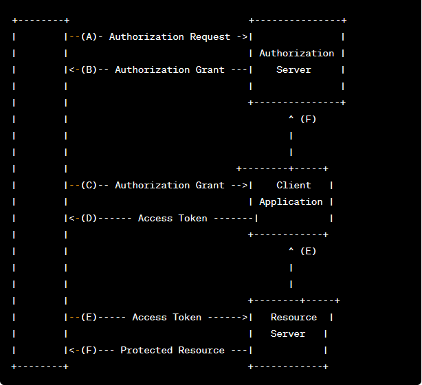

# OAuth2协议介绍以及第三方授权认证实现

## OAuth2协议介绍

OAuth2（开放授权2.0）是一种授权框架，允许第三方应用在不获取用户凭证的情况下访问用户在另一个服务上的受保护资源。它被广泛用于各种互联网服务中，特别是在身份验证和授权方面。

### OAuth2的关键角色

- **资源所有者（Resource Owner）：** 即用户，拥有受保护资源的用户或者是允许访问的实体。
- **客户端（Client）：** 第三方应用，希望访问用户的受保护资源，但无法直接获得用户的凭证。
- **授权服务器（Authorization Server）：** 负责认证用户并颁发访问令牌（Access Token）给客户端。
- **资源服务器（Resource Server）：** 存储受保护资源的服务器，可以接收并响应使用访问令牌的请求。

### OAuth2的工作流程

1. **认证请求（Authorization Request）：** 客户端向授权服务器发送认证请求，请求访问受保护资源。
2. **用户认证（User Authentication）：** 用户登录并授权客户端访问其受保护资源。
3. **颁发访问令牌（Access Token Grant）：** 授权服务器向客户端颁发访问令牌。
4. **访问受保护资源（Access Protected Resource）：** 客户端使用访问令牌请求资源服务器获取受保护资源。

### OAuth2的示意图


## 第三方授权认证如何实现

### 基本思路
- **授权机制：** 第三方管理和资源分配功能。第三方可以自行申请（如微信认证），或由营运人员添加，管理员审核通过后生成appId和appSecret，通过邮件或短信通知第三方。
- **认证机制：** 确定第三方合法性，以及第三方访问资源的权限。
- **授权服务颁发令牌：** 设计安全可靠的令牌颁发方式。

### 基本流程
1. 本文提供渠道的管理，去模拟第三方的授权，资源分配功能省略，审核通过后会生成appId和appSecret，通知第三方功能省略；
2. 第三方如何访问资源访问器，提供了一个获取令牌的接口/openapi/token/get，客户端拿到令牌后需要存储该令牌，待访问资源时将该令牌放入头信息中；
3. 定义拦截器去拦截所有的资源服务器接口，即/openapi/**，即只有令牌校验通过的才能访问资源服务器接口；
4. 如何去校验该第三方能访问该资源，通过channelId去校验（授权服务第三方的标识），本文只校验了channelId的存在性；
5. 访问令牌如何设计，首先需要设计一个签名生成规则，用于获取令牌，同时又要保证appSecret不要泄露，本文提供了令牌和签名生成的util。
   - **签名设计（sign）：** 使用AES算法和appSecret生成签名。
     ```
     SymmetricCrypto aes = new SymmetricCrypto(SymmetricAlgorithm.AES, appSecret.getBytes());
     String sign = aes.encryptHex(random);
     ```
   - **令牌获取示例：**
     令牌使用Jwt，加密算法HS256
     ```
     {
         "appId": "4n5n0x28tpgs8pcb",
         "random": "hb@jk2ejw#",
         "sign": "f06e97e1780955420c47f7f4784def13"
     }
     {
         "code": 200,
         "data": {
             "expiration": 7200,
             "token": "eyJhbGciOiJIUzI1NiIsInppcCI6IkRFRiJ9.eNokjUEOgyAURO_y15IAAqI36Lon-HyotTFIBFLTpncvxt3kvcnMF3J1MIGADjClm29ZRR35IW1Jc7aJ3KXugfZQmq5-9qoOQ_UU1lzf9lO1DzL7regNl73Vw5FgEgNXhhvVyw4WLBfQ4yhPQE-MMaznn-jgVZY23JMnLbhiDrlgCjUyi2SZ41KOXD6UIYTfHwAA__8.NFEd5eZwHrG0mXAtDPGk84Mht4BPqjowiG6eTl8MpxM"
         },
         "msg": "Success"
     }
     ```
### 使用指南

1. 本文介绍第三方认证的基本思想，以及实现流程，小伙伴们可以借鉴参考，主要是实现思路；
2. 提供了安靠可靠的签名机制，用于获取令牌，可以参考；
3. 提供了令牌生成规则，可以参考。

这些内容能帮助读者更好地理解认证流程，并提供了安全可靠的实现方案。如果需要更多的优化或补充，请告诉我。


